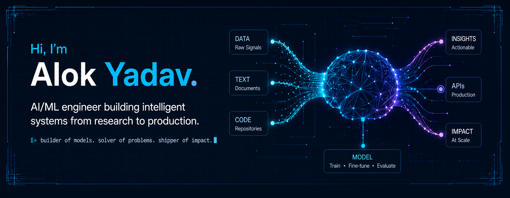
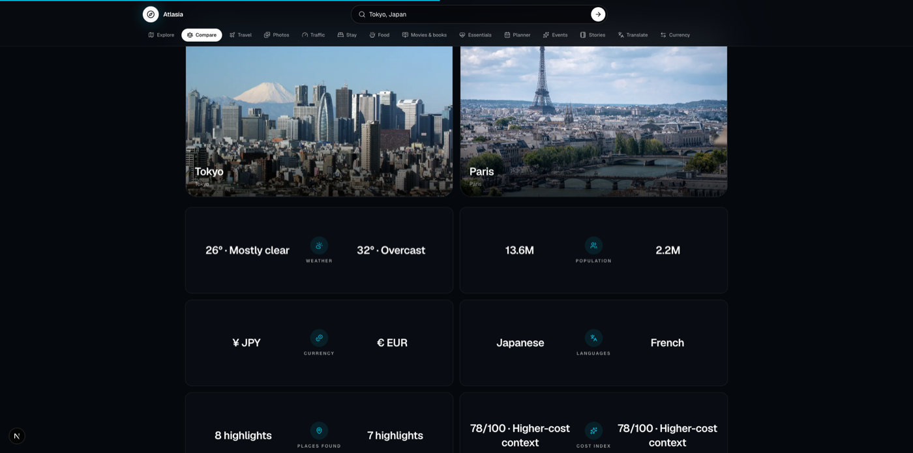

<div align="center">



<br />

<a href="https://atlasia-explorer.vercel.app">
  
</a>

<br />

<a href="https://atlasia-explorer.vercel.app"></a>
<a href="https://linkedin.com/in/AlokYadav2500"></a>
<a href="mailto:ay252003@gmail.com"></a>
<a href="https://github.com/Alok-Yadav25"></a>

</div>

## About

I build end-to-end **machine learning and LLM-powered products**: from data and modeling to APIs, interfaces, deployment, and the reliability work that makes a system useful outside a notebook.

- **Focus:** computer vision, NLP, predictive modeling, RAG pipelines, and MLOps
- **Working with:** PyTorch, FastAPI, scikit-learn, Next.js, AI SDK, Groq, and Supabase
- **Learning deeper:** LLM fine-tuning, evaluation, and production AI systems
- **Open to:** AI/ML engineering opportunities and ambitious technical collaborations

## Recent flagship build

<div align="center">

<a href="https://atlasia-explorer.vercel.app">
  
</a>

</div>

### [Atlasia](https://github.com/Alok-Yadav25/Atlasia) — place intelligence, connected

Atlasia is a weather-reactive place intelligence and trip-planning platform. Search any place and move through its story, weather, food, people, transport, maps, stays, events, comparisons, photo atlas, and an in-context AI travel companion in one connected experience.

`Next.js` · `TypeScript` · `AI SDK` · `Groq` · `Supabase` · `OpenStreetMap` · `Wikimedia`

[**Live experience**](https://atlasia-explorer.vercel.app) · [**Source code**](https://github.com/Alok-Yadav25/Atlasia)

## Systems I've shipped

| Project | What it does | Core stack |
| :--- | :--- | :--- |
| **[CodeLens](https://github.com/Alok-Yadav25/Codelens)** | Reviews code with CodeBERT and LLaMA 3.1, then returns contextual improvement suggestions through a focused developer workflow. | `Python` `PyTorch` `FastAPI` `Groq` |
| **[Suraksha Setu](https://github.com/Alok-Yadav25/Fake-bank-apk-detection)** | Detects suspicious banking APKs using static analysis, permission patterns, feature engineering, and LightGBM classification. | `Python` `Androguard` `LightGBM` `scikit-learn` |
| **[Stock Price Predictor](https://github.com/Alok-Yadav25/Stock-prediction-using-LSTM)** | Forecasts market movement with an LSTM pipeline trained on historical and live market data. | `Python` `PyTorch` `LSTM` `Pandas` |

## Technology I work with

<div align="center">


</div>

<br />

```text
data / text / code  ->  model  ->  API  ->  product  ->  measurable impact
```

## GitHub signal

<div align="center">


<br />


</div>

## Contribution flow

<div align="center">

<picture>
  <source media="(prefers-color-scheme: dark)" srcset="https://raw.githubusercontent.com/Alok-Yadav25/Alok-Yadav25/output/github-contribution-grid-snake-dark.svg" />
  <source media="(prefers-color-scheme: light)" srcset="https://raw.githubusercontent.com/Alok-Yadav25/Alok-Yadav25/output/github-contribution-grid-snake.svg" />
  
</picture>

<br />

<sub>The animation refreshes automatically every day.</sub>

</div>

---

<div align="center">

**Building useful intelligence, one shipped system at a time.**

<a href="mailto:ay252003@gmail.com">Let's build something intelligent.</a>

<br /><br />


</div>
